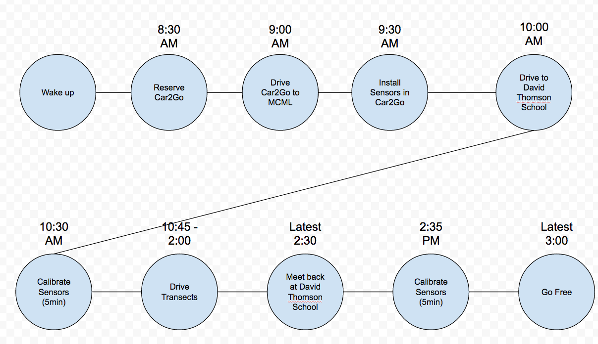

<CENTER>
IT IS IMPORTANT THAT DRIVE SAFELY AND WITHIN YOUR COMFORT ZONE. IF ANY INTERSECTIONS OR UNPROTECTED TURNS ARE TOO BUSY OR YOU FEEL THAT THEY ARE DANGEROUS, FEEL FREE TO FIND ALTERNATIVE ROUTES.
</CENTER>

***


# Measurement Campaign #2

 
<br>
*** 
<br>

## Preparations: Download the Car2Go App for your smartphone or ipad

You can download the app [here](https://www.car2go.com/en/austin/car2go-apps/) - available for iphone/ipad and android.

* Please be sure to download and set it up on your device to speed up the process on the day of the experiment if you haven't used it yet.

 
<br>
*** 
<br>

# Plan Overview



## Drivers + co-pilots:

| Driver  | Co-pilot |
|---------|----------|
| Andreas | Natasha      |
| Wes     | Caitlin    |
| Joey    |   |
|Ryan Buchanan  | Nick     |
| Julie   | Yimei  |


## Co-pilots
* **If you are co-pilot - meaning you are not driving, but helping with routing and emotional support - please go to**:
	* the [Macmillan Loading Dock](https://www.google.ca/maps/place/49%C2%B015'40.9%22N+123%C2%B015'05.2%22W/@49.2613654,-123.2523162,324m/data=!3m2!1e3!4b1!4m2!3m1!1s0x0:0x0?hl=en) at UBC 
	* by 9:30 AM.
	* **It is your job as the co-pilot to read the directions and direct the driver. It is also your responsibility to re-direct the driver in case the directions are not navigable (e.g. a one way street, etc.)**


## Drivers
**If you are a driver:**

1. **8:30 AM - Reserve your Car2Go**: > 
	* At 8:30AM use the Car2Go Mobile App ([android](https://play.google.com/store/apps/details?id=com.car2go&hl=en), [iOS](https://itunes.apple.com/ca/app/car2go/id514921710?mt=8)) or the [Web App](https://www.car2go.com/en/vancouver/) to reserve your Car2Go. 
	

2. **9:00 AM - Get your Car2go**: 
	* [**Without** Smartphone/Internet Access] - Andreas and Kelsey:
		* Meet at **MacMillan 130** so we can coordinate a Car2Go on campus. We will then rent the Car2Go on campus. 
		* **If you have an i-pad or tablet, please bring this along with you**. We can tether from my Wifi (if the UBC network is not available)
	* [**With** Smartphone/Internet Access]:
		* Hop in to the Car2Go nearest you (e.g. near your house) and drive to the loading dock in the back of the MacMillan Building
	* **IMPORTANT!**: Make sure to select the **Micrometeorology Group** Account when prompted or else you will be charging yourself! 
	
	[Click here for the location of the loading dock](https://www.google.ca/maps/place/49%C2%B015'40.9%22N+123%C2%B015'05.2%22W/@49.2613654,-123.2523162,324m/data=!3m2!1e3!4b1!4m2!3m1!1s0x0:0x0?hl=en)
	
3. **9:30 AM - Meet at MacMillan Loading Docks**
	* All of the drivers and co-pilots will join forces - you will get your directions.
	* We will install the sensors in each of the vehicles.
	* This will take about 15-20 minutes, depending on how quick we are.


4. **10:00 AM - Drive to David Thomson Secondary School** 
	* Leave to meet at the SOUTH EAST corner of David Thompson Secondary School
	* link: [googlemaps](https://www.google.ca/maps/place/David+Thompson+Secondary+School/@49.220862,-123.07058,15z/data=!4m2!3m1!1s0x0:0xc8367ae140cc277b). 
	* **We will do a 5-min calibration to measure what our values are before the traverse**.

	```
	Southeast corner of
	David Thomson Secondary School
	1755 E 55th Ave
	Vancouver, BC V5P 1Z7
	```

	Images:
	
	
	


5. **10:30 - The traverse begins!**  
	* Each of us will go our separate ways to start measuring along our prescribed transects until the route is completed. 
	* Each of the routes will lead you back to the meeting point, David Thompson Secondary School. See transect assignments above. 
	* Each of us will be driving approximately 70 - 80 km. Depending on traffic, this should take about 3 hours. 
	* **If you haven't completed your route by 2:00 PM, please return to the School**.
 
6. **2:30 - Meet Back at David Thomson Secondary School**
 	* ** we will leave the sensors running side by side for 5 minutes to determine the drift**
 
7. **2:45 - Go Free**
 	* Go back to UBC or Go free
 
8. **Make sure to end your trip**
 
 	* @Andreas and @Kelsey - we will have to make sure you end your trip in a wi-fi zone or tethered to my wifi.
 
9. **PARTYYY!!!** (figuratively)
 
 
 
<br>
*** 
<br>

## Sensor Assignments and Route Instructions:
* [Andreas + Natasha - 1641 (car2go)](routes/route_1641.md)
	*  	
* [Joey - 0108 (car2go)](routes/route_0108.md)
 	*  	
* [Julie + Yimei- 0151 (car2go)](routes/route_0151.md)
 	* 
* [Ryan + Nick - 0150 (Car2Go)](routes/route_0150.md)
 	* 
* [Wes + Caitlin - 0205 (Car2Go)](routes/route_0205.md)
 	* 

NOTE: You are only to use the Micrometeorology Group Car2Go account of Experiments coordinated by the lab. Any misuse of the account will result in disciplinary action. 

<br>
*** 
<br>
 
## Troubleshooting / Things to keep an eye on:
1. **Make sure that your sensor has 2 LED lights on**.
	a. 	If none of the lights are on, then you might need to unplug and replug your sensor. If this does not work, then please call Joey immediately. (fingers crossed this does not happen)
	b.  If 1 light is on and the other is blinking, that means that there has not been a GPS Fix yet. Please wait until both lights are fully on. In some cases, the GPS antennae might have become disconnected internally and you might have to reconnect this. 
	

<br>
*** 
<br>

## Contact info:
In case anything happens during the drive, please do not hesitate to call.
## Joey: 
	+1 778 989 8616
	
## Emergency:
	911

 	
 	
 
	
