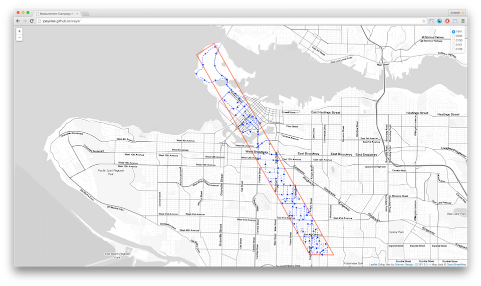
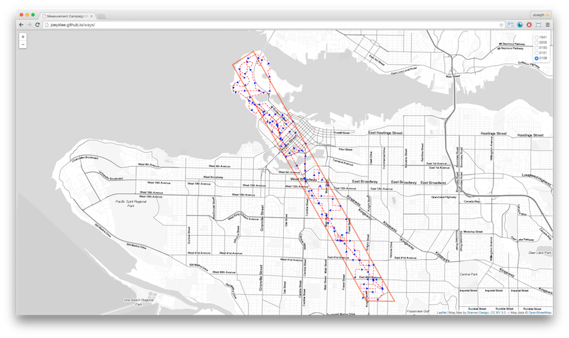
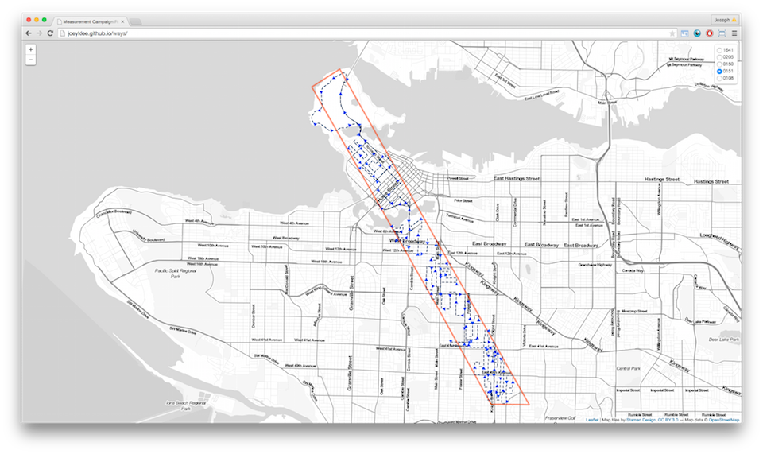
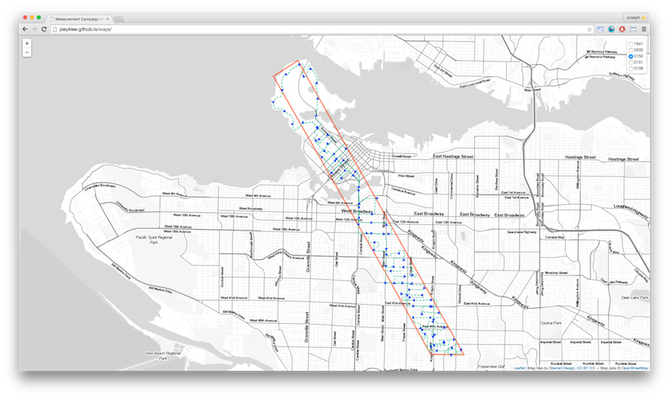
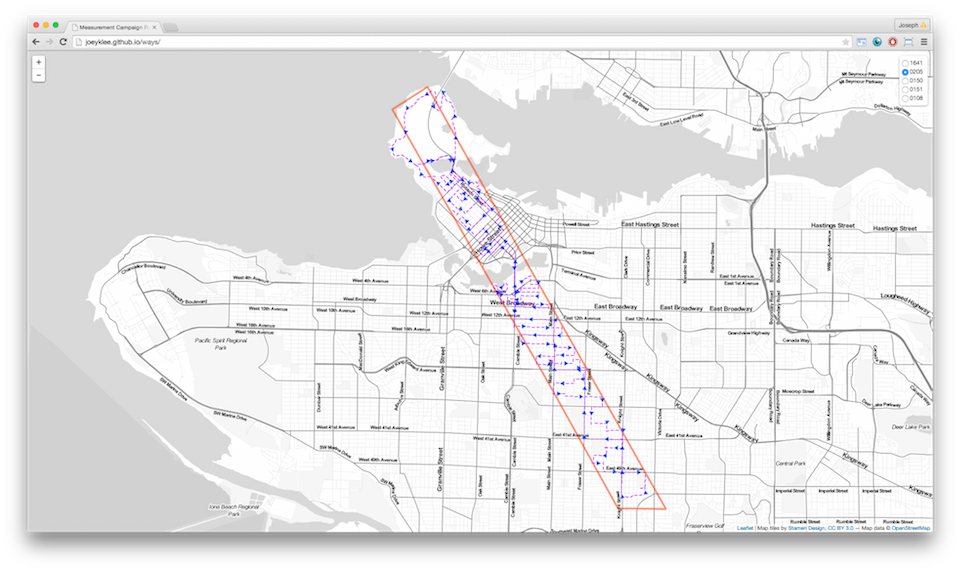
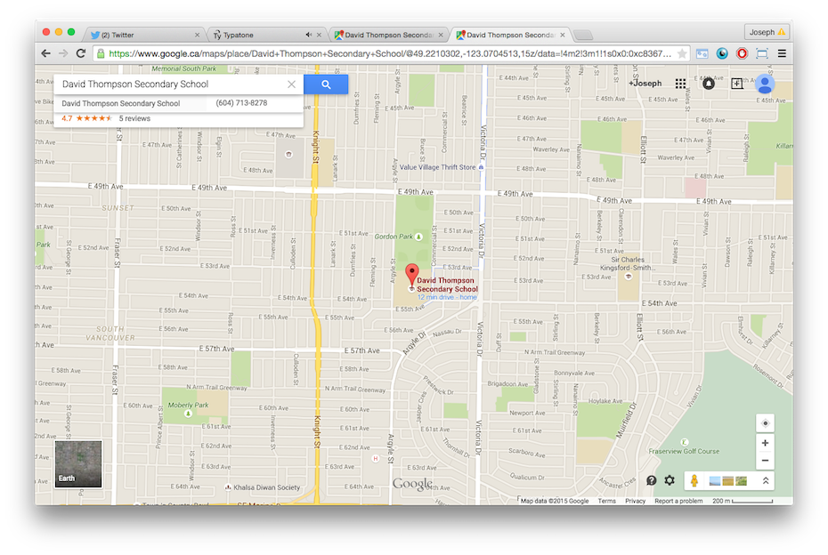
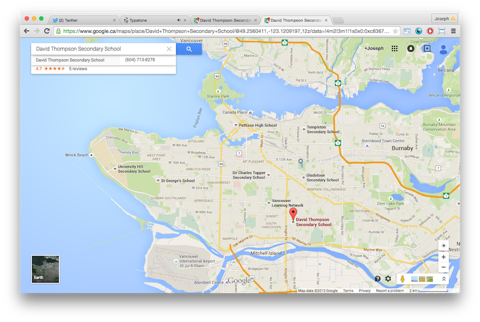
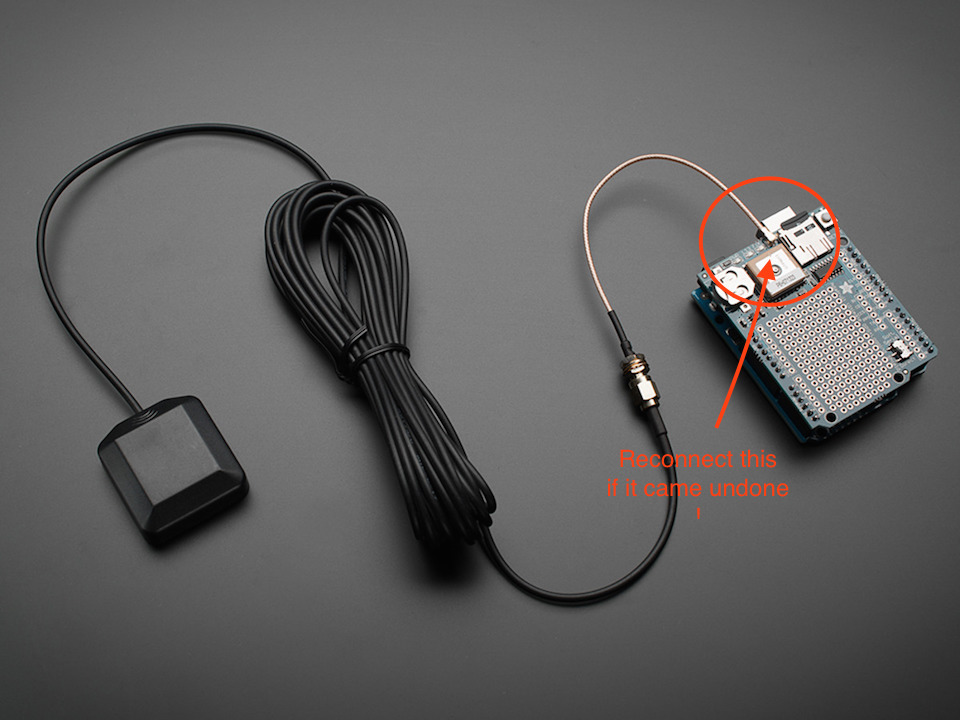

<CENTER>
IT IS IMPORTANT THAT DRIVE SAFELY AND WITHIN YOUR COMFORT ZONE. IF ANY INTERSECTIONS OR UNPROTECTED TURNS ARE TOO BUSY OR YOU FEEL THAT THEY ARE DANGEROUS, FEEL FREE TO FIND ALTERNATIVE ROUTES.
</CENTER>

***


# Measurement Campaign #2


## Contact info:
In case anything happens during the drive, please do not hesitate to call.
## Joey: 
	+1 778 989 8616
	
## Emergency:
	911

## Sensor Assignments and Route Instructions:
* [Andreas - 1641 (car2go)](routes/route_1641.md)
	*  	
* [Joey - 0108 (car2go)](routes/route_0108.md)
 	*  	
* [Zoran - 0151 (car2go)](routes/route_0151.md)
 	* 
* [Nick - 0150 (Micromet Truck)](routes/route_0150.md)
 	* 
* [Rick (or Ryan) - 0205 (Personal Vehicle)](routes/route_0205.md)
 	* 


## Real-time GPS Location:

Use the little web app below to see where you are on the map. 

[http://joeyklee.github.io/co2routes/](http://joeyklee.github.io/co2routes/)

You can select the sensor that you have (e.g. sensor 0108) and see where you are going relative to the path.

The orange rectangle marks the study area bounds - please try to stay within the bounds if possible.


##  Preparations: 

### Download the Car2Go App for your smartphone or ipad

You can download the app [here](https://www.car2go.com/en/austin/car2go-apps/) - available for iphone/ipad and android.

* Please be sure to download and set it up on your device to speed up the process on the day of the experiment if you haven't used it yet.


### Reserve a Car2go Vehicle Nearest you or at UBC

> For those using Car2Go:

* At ```9:00 AM``` please **reserve a car2go vehicle** nearest you or at UBC.
* During the morning rush hours, the car2gos can dissapear quickly so be sure to reserve one!
* You will have 30 minutes then to then pick up your car. 
* We will meet at UBC, so you can either reserve a car close to your home or one on campus.

> if your reservation expires?

* Just re-reserve the car 

> For those using your personal vehicle or micromet truck - please ignore


### Snacks:
Feel free to bring some snacks. The drive will take between 3 - 4 hours. I will provide some light breakfast food, so please come on time!

### [If you're driving your own vehicle] Record your gas mileage!!!:
SUPER IMPORTANT SO THAT WE CAN REIMBURSE YOU: Record your gas mileage before and after - joey will also take photos -- so that we can properly reimburse you for the driving. 


##  Experiment: 

### Pick up your Car2Go Vehicle

* Pick up your car2go vehicle that you reserved

> I don't have a smart phone? (e.g. Andreas)

* You can use your ipad OR Coordinate with Joey to pick up the car in the morning.


### 9:30 AM - Go to the meeting place at the loading dock parking lot of MCML (MacMillan / land and food systems):

Please be at the [loading docks/parking area of MCML](https://www.google.ca/maps/place/49%C2%B015'41.0%22N+123%C2%B015'05.0%22W/@49.2613759,-123.2519335,134m/data=!3m2!1e3!4b1!4m2!3m1!1s0x0:0x0?hl=en) by 10:00 AM. We will set up/install the sensors here.

While this is happening, record the current car mileage for each vehicle.


### 5 minute calibration period:

We will leave the sensors running for 5 minutes together to calibrate them to determine the drift at the end of the experiment


### Drive to at the SOUTH EAST corner of David Thompson Secondary School
Meeting point and time:

link: [googlemaps](https://www.google.ca/maps/place/David+Thompson+Secondary+School/@49.220862,-123.07058,15z/data=!4m2!3m1!1s0x0:0xc8367ae140cc277b). 
	
	Southeast corner of
	David Thomson Secondary School
	1755 E 55th Ave
	Vancouver, BC V5P 1Z7
	
	10:00 AM 
	Thursday, April 28th, 2015
	

Images:




### Go! (~10:30am)
Each of us will go our separate ways to start measuring along our prescribed transects until the route is completed. Each of the routes will lead you back to the meeting point, David Thompson Secondary School. See transect assignments above. 

Each of us will be driving approximately 70 - 80 km. Depending on traffic, this should take about 3 hours. 

If you haven't completed your route by 2 PM, please return to the School.

###  Meet back at David Thompson Secondary School

* we will leave the sensors running side by side for 5 minutes to determine the drift

## Record how many km you drove
Note how many km were driven per car for reimbursement purposes.

### Step 6: Return the vehicles to UBC and/or go free. 

<br>
## Troubleshooting / Things to keep an eye on:
1. **Make sure that your sensor has 2 LED lights on**.
	a. 	If none of the lights are on, then you might need to unplug and replug your sensor. If this does not work, then please call Joey immediately. (fingers crossed this does not happen)
	b.  If 1 light is on and the other is blinking, that means that there has not been a GPS Fix yet. Please wait until both lights are fully on. In some cases, the GPS antennae might have become disconnected internally and you might have to reconnect this. 
	

***

<CENTER>
*** IT IS IMPORTANT THAT DRIVE SAFELY AND WITHIN YOUR COMFORT ZONE. IF ANY INTERSECTIONS OR UNPROTECTED TURNS ARE TOO BUSY OR YOUR FEEL THAT THEY ARE DANGEROUS, FEEL FREE FIND ALTERNATIVE ROUTES***
</CENTER>

